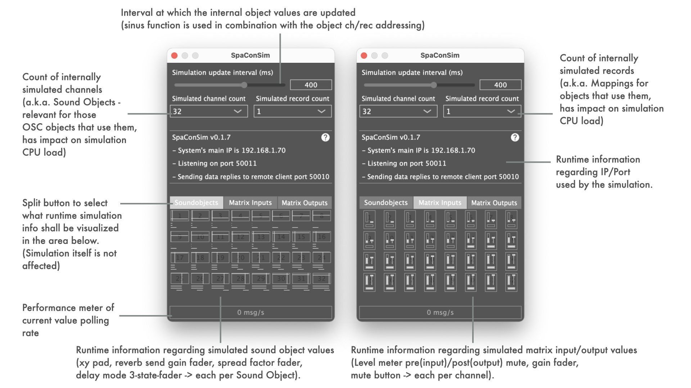

SpaConSim is a PRIVATELY created and driven project.

It was created to be a minimal tool for simulation of the OSC message response behaviour of a d&b audiotechnik DS100 Soundscape signal bridge and aims at supporting development and testing of 3rd party software tools.

See [LATEST RELEASE](../../releases/latest) for available binary packages.

It is neither suppported nor driven by official d&b activities.

SpaConSim currently supports simulation of 32, 64 or 128 channels for simulation and only one or all 4 mapping areas per object.

The following objects are simulated:
- Mapped Sound Object Position XY
- Mapped Sound Object Position X
- Mapped Sound Object Position Y
- Matrix Input ReverbSendGain
- Sound Object Spread
- Sound Object Delay Mode
- Matrix Input Levelmeter pre Mute
- Matrix Input Gain
- Matrix Input Mute
- Matrix Output Levelmeter post Mute
- Matrix Output Gain
- Matrix Output Mute

The UI allows adjusting of simulation update interval in milliseconds. Practically speaking, this parameter influences the object value change speed.

SpaConSim announces its OSC capabilities as zeroconf service via Servus API. The implementation currently only works on systems with already running dnssd service (macOS, iOS).